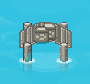

#[class Deck : public Obstacle

Definition of **deck** obstacle. Reduce one life when player hits one.

데크 장애물을 정의하는 클래스. 충돌시 목숨 1개 감소.

## Definition

Implementation of deck object in game. Decrements `life_count` by 1 on collision.

Texture of the original game is shown in the image below.



## Member variables

### Member variables inherited from class [GameObject](../../GameObject.md)

[`object_count`](../../GameObject.md#object_count), 
[`object_id`](../../GameObject.md#object_id), 
[`center_x`](../../GameObject.md#center_x), 
[`center_y`](../../GameObject.md#center_y), 
[`width`](../../GameObject.md#width), 
[`height`](../../GameObject.md#height), 
[`texture`](../../GameObject.md#texture)

### texture

Texture of the object. Will be set with `SetTexture()` in the constructor.

#### Texture example

- `width`: 2
- `height`: 2

```
▨▨
|  |
```

## Constructors

### Deck

```cpp
public Deck()
```

Instantiates the `Deck` object. Initializes with default position `(0.0, 0.0)`.

### Deck(float, float)

```cpp
public Deck(float x, float y)
```

Instantiates the `Deck` object. Initializes with given position.

## Member functions

### Member functions inherited from class [GameObject](../GameObject.md)

[`GetID`](../GameObject.md#GetID), 
[`GetCenterX`](../GameObject.md#GetCenterX), 
[`GetCenterX`](../GameObject.md#GetCenterX), 
[`GetWidth`](../GameObject.md#GetWidth), 
[`GetHeight`](../GameObject.md#GetHeight), 
[`GetTexture`](../GameObject.md#GetTexture), 
[`Setters`](../GameObject.md#Setters), 
[`SetCenter`](../GameObject.md#SetCenter), 
[`SetWidth`](../GameObject.md#SetWidth), 
[`SetHeight`](../GameObject.md#SetHeight), 
[`SetTexture`](../GameObject.md#SetTexture), 
[`HasIntersected`](../GameObject.md#HasIntersected)

### HitBy

```cpp
public void HitBy(MovableObject& object)
```

Decreases `life_count` by 1 and make the player invincible for a while.
