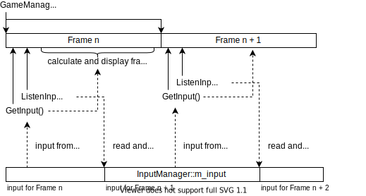

# class InputManager

Manages and returns user input.

사용자의 입력을 받아서 반환하는 클래스.

## Description

This class handles the keyboard input from user. List of possible inputs and its corresponding member functions are listed below.

| Key                |       keyCode      | Action | Action description                                                                       | Member function                   |
|--------------------|:------------------:|--------|------------------------------------------------------------------------------------------|-----------------------------------|
| `SPACE`            |         32         |`SPACE` | **start or pause**  the gameplay                                                         | [`IsInputSpace()`](#IsInputSpace) |
| `UP` (`w`, `W`)    | 224 → 72 (119, 87) |`UP`    | **stop**  the player                                                                     | [`IsInputUp()`](#IsInputUp)       |
| `DOWN` (`s`, `S`)  | 224 → 80 (115, 83) |`DOWN`  | **use boost**  if player is heading downwards, make player  **head downward**  otherwise | [`IsInputDown()`](#IsInputDown)   |
| `LEFT` (`a`, `A`)  |  224 → 75 (97, 65) |`LEFT`  | rotate the player to the **left**                                                        | [`IsInputLeft()`](#IsInputLeft)   |
| `RIGHT` (`d`, `D`) | 224 → 77 (100, 68) |`RIGHT` | rotate the player to the  **right**                                                      | [`IsInputRight()`](#IsInputRight) |
| `f`, `F`           | 102, 70            |`BOOST` | **use boost**                                                                            | [`IsInputBoost()`](#IsInputBoost) |
| `ESC`              | 27                 |`EXIT`  | **exit game**                                                                            | [`IsInputExit()`](#IsInputExit)   |

## Member variables

### m_input

```cpp
private int m_input;
```

The input read from keyboard. Updated with [`ListenInput()`](#ListenInput) function call.

If there was no input read, `m_input` returns `-1`.

### m_input_special

```cpp
private int m_input_special;
```

The secondary input from keyboard. Used when the value of the first input `m_input` is `0` or `224`.

> Read [this](https://stackoverflow.com/a/10473315/4524257) to see how arrow keys are handled in C++ on Windows.
### is_up_pushed
```cpp
private bool is_up_pushed = false
```
Check if the `UP` key is pressed. default is `false`
### is_down_pushed
```cpp
private bool is_down_pushed = false
```
Check if the `DOWN` key is pressed. default is `false`
### is_left_pushed
```cpp
private bool is_left_pushed = false
```

Check if the `LEFT` key is pressed. default is `false`
### is_right_pushed
```cpp
private bool is_right_pushed = false
```
Check if the `RIGHT` key is pressed. default is `false`
### is_space_pushed
```cpp
private bool is_space_pushed = false
```
Check if the `SPACE` key is pressed. default is `false`
### is_f_pushed
```cpp
private bool is_f_pushed = false
```
Check if the `F` key is pressed. default is `false`
### is_esc_pushed
```cpp
private bool is_esc_pushed = false
```
Check if the `ESC` key is pressed. default is `false`
#### Input read/write timing

Input for next frame (next `GameManager::Render()` function call) is saved in `m_input`. `ListenInput()` waits for user input and updates `m_input` when `getch()` returns a value, and `GetInput()` returns the saved `m_input` value.

<details>
<summary>Data flow diagram</summary>
<br>



Click [here](https://app.diagrams.net/#Hbgb10%2Fconsole-surfing-game%2Fmaster%2Fdocs%2Fdiagram%2FInputManager_timing_diagram.drawio.svg) to edit this diagram on _draw.io_.

</details>

## Constructor

### InputManager

```cpp
public InputManager()
```

Instantiates the `InputManager` object.

## Member functions

### ListenInput

```cpp
public void ListenInput()
```

Waits for user input and updates `m_input` when `getch()` returns a value.

Initializes `m_input` to `-1` to indicate there is no input.

### GetInput

```cpp
public int GetInput()
```

Returns the saved input `m_input`.

If `m_input` is `0` or `244`, return `m_input_special` instead.

### IsInputSpace

```cpp
public bool IsInputSpace()
```

Returns true if the input corresponds to `SPACE`.

### IsInputUp

```cpp
public bool IsInputUp()
```

Returns true if the input corresponds to action `UP`.

### IsInputDown

```cpp
public bool IsInputDown()
```

Returns true if the input corresponds to action `DOWN`.

### IsInputLeft

```cpp
public bool IsInputLeft()
```

Returns true if the input corresponds to action `LEFT`.

### IsInputRight

```cpp
public bool IsInputRight()
```

Returns true if the input corresponds to action `RIGHT`.

### IsInputBoost

```cpp
public bool IsInputBoost()
```

Returns true if the input corresponds to action `BOOST`.

### IsInputExit

```cpp
public bool IsInputExit()
```

Returns true if the input corresponds to action `EXIT`.
